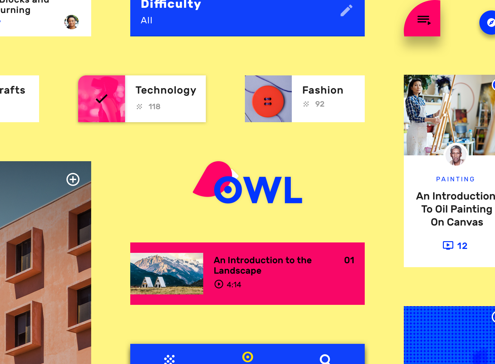
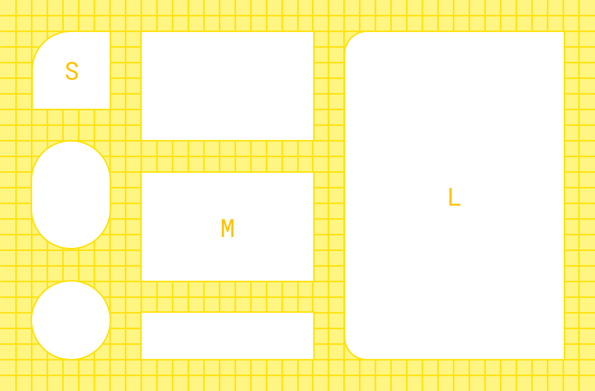

# Owl



## Introduction
This project is an Android implementation of [Owl](https://material.io/design/material-studies/owl.html), a Material Study showcasing the possibilities of using Material Theming and Material Components for Android.

## Screenshots


## Material Theming
Owl uses Material Theming to customize the app’s [color](https://material.io/develop/android/theming/color/), [shape](https://material.io/develop/android/theming/shape/) and [typography](https://material.io/develop/android/theming/typography/).

### Color


Owl has three primary colors which are used to create distinct visual themes for each section. See [color.xml](Owl/app/src/main/res/values/color.xml) for the full color scheme and how colors are applied across [default](app/src/main/res/values/theme.xml#L58-L86) and [dark](app/src/main/res/values-night/theme.xml) themes.

### Shape


Owl defines small, medium and large shape categories for different sized components. See [shape.xml](app/src/main/res/values/shape.xml) which defines the `ShapeAppearance`s, which are then [set in the theme](app/src/main/res/values/theme.xml#L20-L23) and picked up by all components or referred to directly.

### Typography


Owl’s type scale provides the typographic variety necessary for the app content. All items in the type scale use [Rubik](https://fonts.google.com/specimen/Rubik) as the typeface, and make use of the variety of weights available by using Rubik Regular, Medium, and Bold. See [type.xml](app/src/main/res/values/type.xml) which defines `TextAppearance`s which are then [set in the theme](app/src/main/res/values/theme.xml#L25-L38) and referred to using `?attr/textAppearance[...]` throughout.

## License

```
Copyright 2019 Google, Inc.

Licensed to the Apache Software Foundation (ASF) under one or more contributor
license agreements. See the NOTICE file distributed with this work for
additional information regarding copyright ownership. The ASF licenses this
file to you under the Apache License, Version 2.0 (the "License"); you may not
use this file except in compliance with the License. You may obtain a copy of
the License at

http://www.apache.org/licenses/LICENSE-2.0

Unless required by applicable law or agreed to in writing, software
distributed under the License is distributed on an "AS IS" BASIS, WITHOUT
WARRANTIES OR CONDITIONS OF ANY KIND, either express or implied. See the
License for the specific language governing permissions and limitations under
the License.
```
