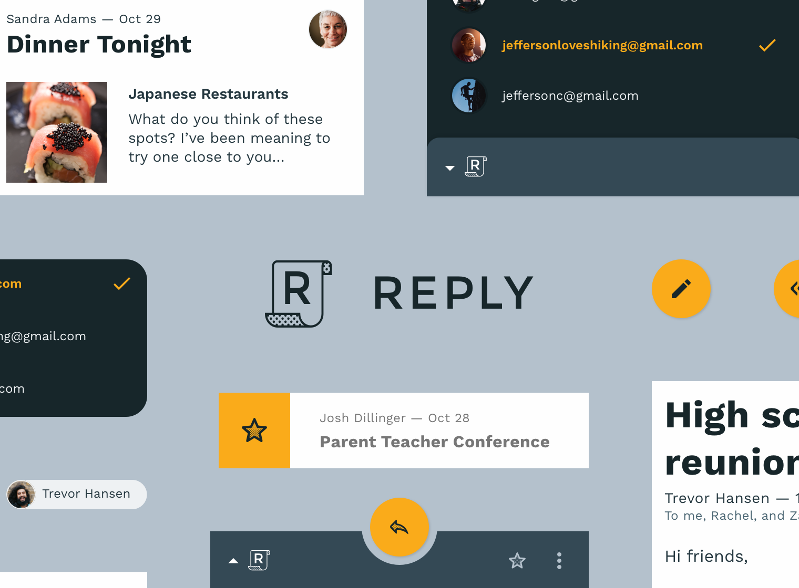
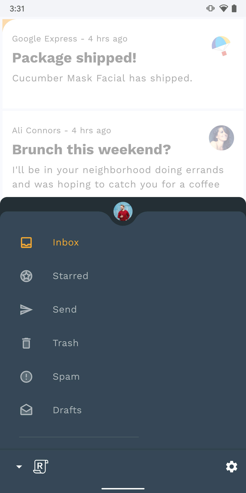
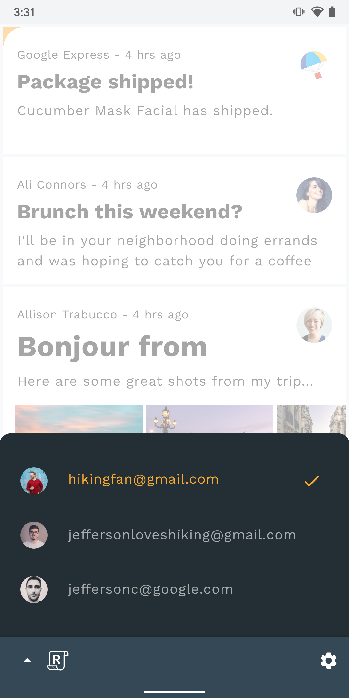
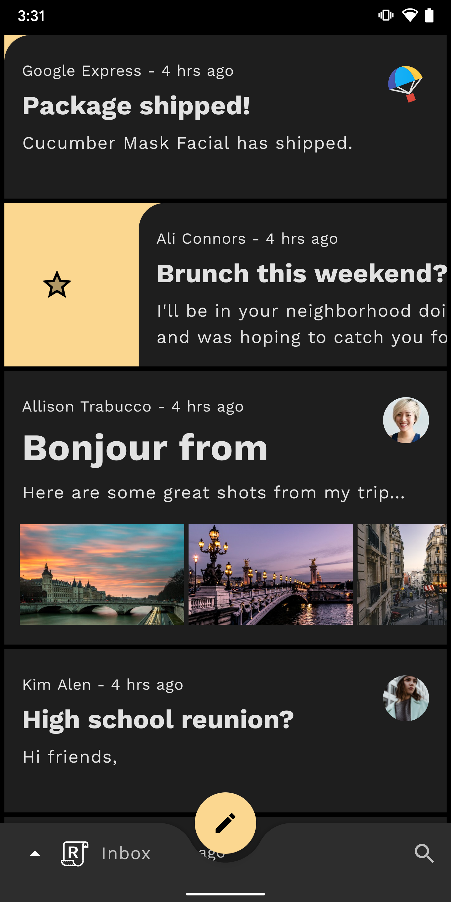
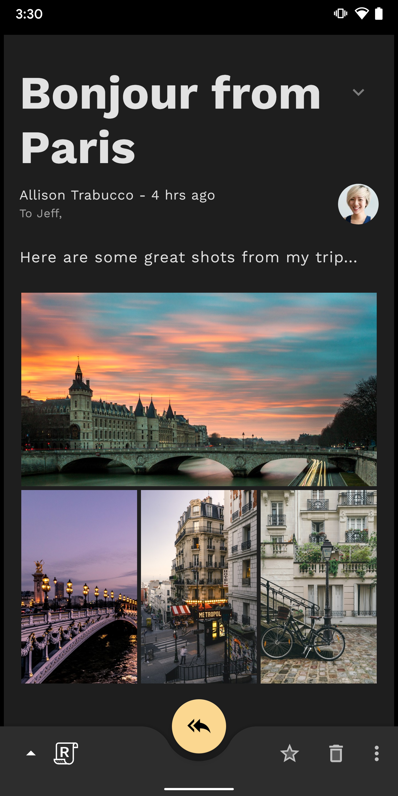
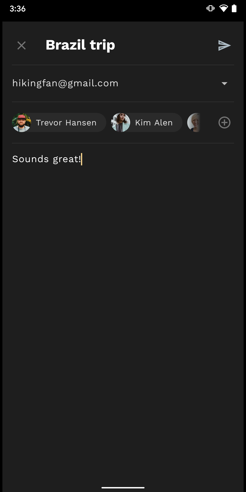
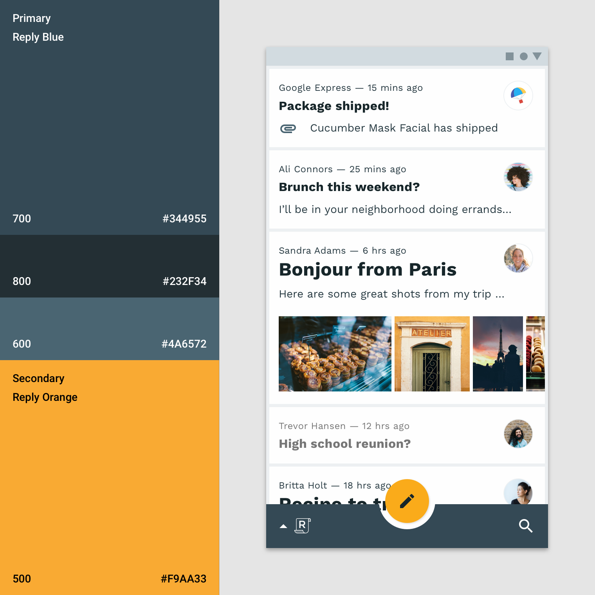
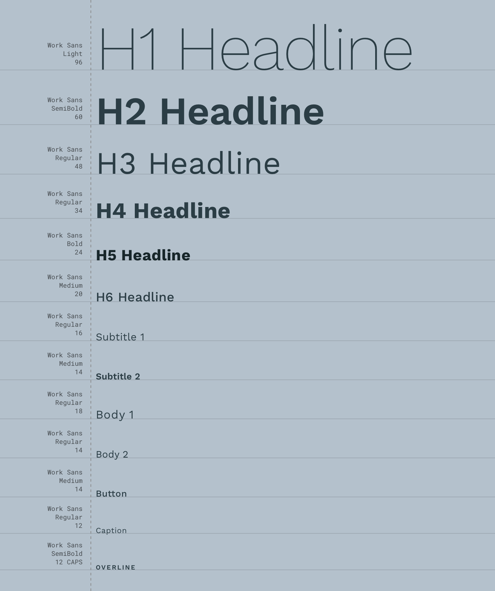
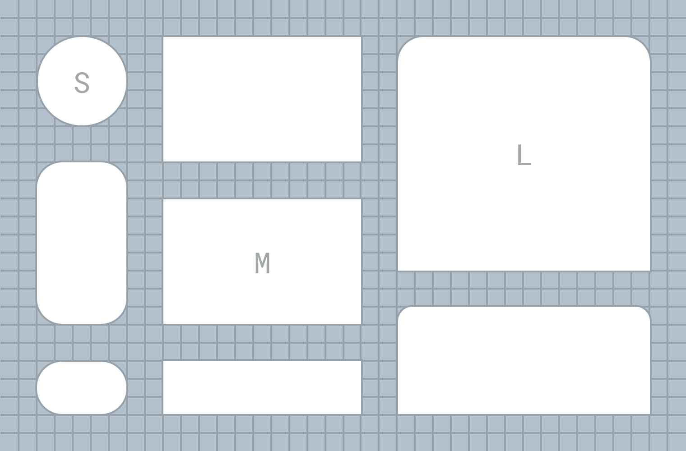

# Reply


## Introduction
This project is the Android implementation of [Reply](https://material.io/design/material-studies/reply.html), a Material Study showcasing the possibilities of using Material Theming and Material Components for Android.

## Screenshots
   

   

## Material Theming
Reply uses Material Theming to customize the app’s [color](https://material.io/develop/android/theming/color/), [typography](https://material.io/develop/android/theming/typography/) and [shape](https://material.io/develop/android/theming/shape/).

### Color
 

Reply uses a simple, subtle color scheme to save emphasis for email content.  Reply’s color palette is defined in [color.xml](Reply/app/src/main/res/values/color.xml) and applied globally via the app’s [default](Reply/app/src/main/res/values/themes.xml#L23-L37) and [dark](Reply/app/src/main/res/values-night/themes.xml#L22-L36) themes.

### Typography
 

Reply uses [Work Sans](https://fonts.google.com/specimen/Work+Sans)
 as its typeface. All items in the type scale provide the typographic variety necessary for Reply’s content. See [type.xml](Reply/app/src/main/res/values/type.xml) which defines `TextAppearance`s which are then [set in the theme](Reply/app/src/main/res/values/themes.xml#L48-L59) and referred to using `?attr/textAppearance[...]` throughout.

### Shape
 

Reply defines small, medium, and large shape categories for different sized components. See [shape.xml](Reply/app/src/main/res/values/shape.xml) which defines the `ShapeAppearance`s, which are then [set in the theme](Reply/app/src/main/res/values/themes.xml#L43-L45) and picked up by all components or referred to directly.

## License

```
Copyright 2019 Google, Inc.

Licensed to the Apache Software Foundation (ASF) under one or more contributor
license agreements. See the NOTICE file distributed with this work for
additional information regarding copyright ownership. The ASF licenses this
file to you under the Apache License, Version 2.0 (the "License"); you may not
use this file except in compliance with the License. You may obtain a copy of
the License at

http://www.apache.org/licenses/LICENSE-2.0

Unless required by applicable law or agreed to in writing, software
distributed under the License is distributed on an "AS IS" BASIS, WITHOUT
WARRANTIES OR CONDITIONS OF ANY KIND, either express or implied. See the
License for the specific language governing permissions and limitations under
the License.
```
